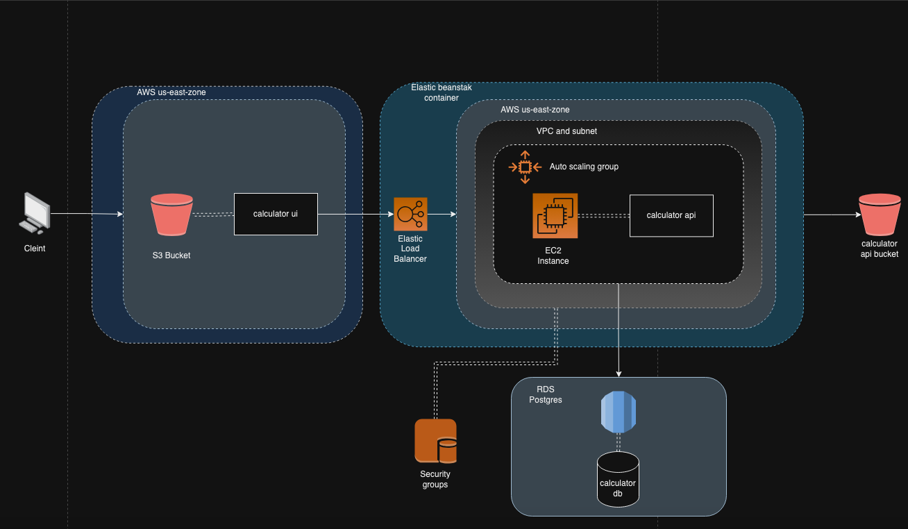
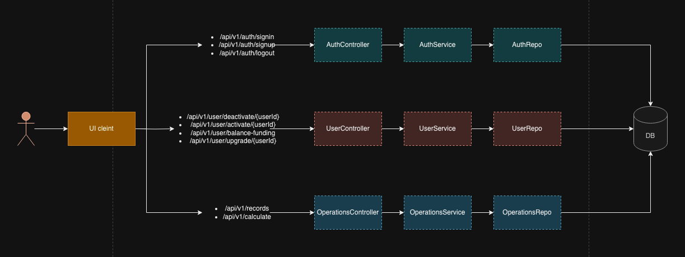
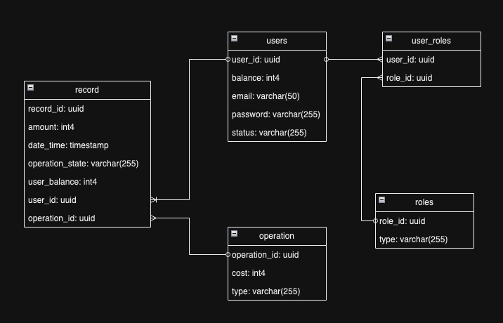

# Calculator App Overview

The app basically consists of typical layered architecture application with a standard ui application written in react and a backend application written in Java/Spring. The high level architecture of the application looks as the following:

As it can be seen the application is deployed now in AWS, where the calculator ui part is deployed in a S3 bucket that hosts static websites and has a public ip. On the other hand the calculator api is deployed in a elastic beanstalk container where the application is encapsulated in a EC2 instance that is tied to an autoscaling group. The static content of that calculator api is being stored in a S3 bucket. The database that is being used now is a PostgreSQL database hosted in AWS RDS. It is also important to mention that the application api is only a monolith that holds all the functionality from the authentication, the users management and the operations which is the core of the application. The ui currently is storing the authentication state using redux to preserve the sessions. Here is a summary of how the application works under the hood:

The database model can be seen in the following diagram:

It is also important to mention that the app is currently being deployed to the cloud using the github actions pipelines.

## Calculator api - How to use it
**Live version:**
* The live public endpoint for this api is http://caculator-app-env.eba-zjmug9a6.us-east-1.elasticbeanstalk.com.
* In order to make use of the endpoints of the api, the user must be registered or the default admin user can be used instead. If you prefer a new user, create one using the `/api/v1/auth/signup` endpoint to create one user, otherwise use the `/api/v1/auth/signin` endpoint to login an already created user, either your custom user or the default one.
* A user is created by using the `/api/v1/auth/signin` endpoint with the USER role permissions. If you want a user with ADMIN permissions out of the default one, a user with ADMIN permissions already must grant permissions by using the `/api/v1/user/upgrade/{userId}` endpoint. 
* There is already a user created; **_username_**: `admin@yopmail.com`, **_password_**: `password`, this user has ADMIN role permissions.
* The Following endpoints require ADMIN role: Upgrade user to ADMIN, Activate user, Deactivate user, Get users.
* The following endpoints require USER role: Process calculation, Add user balance, Get records.
* The following endpoint don't require any permission: Sign in, Sign up, Log out.
* The previously mentioned endpoints can be found in a postman collection named `Calculator API.postman_collection.json` and shared in the root folder.

**Local Environment:**
* Clone the following repo https://github.com/davidgalvis95/calculator-api
* Run `mvn clean install`
* In the terminal go to the root folder of the repository and run `docker-compose up` to start the database.
* Run the following command `mvn spring-boot:run -Dspring-boot.run.profiles=local` to run the api.
* * In order to make use of the endpoints of the api, the user must be registered or the default admin user can be used instead. If you prefer a new user, create one using the `/api/v1/auth/signup` endpoint to create one user, otherwise use the `/api/v1/auth/signin` endpoint to login an already created user, either your custom user or the default one.
* A user is created by using the `/api/v1/auth/signin` endpoint with the USER role permissions. If you want a user with ADMIN permissions out of the default one, a user with ADMIN permissions already must grant permissions by using the `/api/v1/user/upgrade/{userId}` endpoint.
* There is already a user created; **_username_**: `admin@yopmail.com`, **_password_**: `password`, this user has ADMIN role permissions.
* The Following endpoints require ADMIN role: Upgrade user to ADMIN, Activate user, Deactivate user, Get users.
* The following endpoints require USER role: Process calculation, Add user balance, Get records.
* The following endpoint don't require any permission: Sign in, Sign up, Log out.
* The previously mentioned endpoints can be found in a postman collection named `Calculator API.postman_collection.json` and shared in the root folder.

With these simple steps you are all set up.

